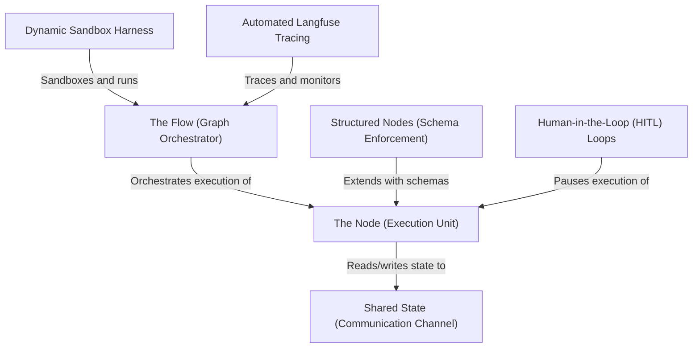

# Pi Codebase Tutorial Builder Extension 🚀 (TUI Mode)


<p align="center">
  
</p>

> *Tired of staring at a massive, complex codebase feeling completely lost? `pi-tutorial-builder` is an elegant, zero-dependency extension for **Pi Coding Agent** that analyzes local repository directories or remote GitHub URLs to package them into highly structured, beautiful, beginner-friendly textbook chapters complete with Mermaid diagram charts.*

---

## 🌟 Visual Indicators & Interactive TUI Loader

The entire multi-layer workspace crawls, analyzes, and drafts chapters asynchronously in the background. It outputs a native, **animated spinning loader** inside the Pi TUI!

```text
┌────────────────────────────────────────────────────────┐
│  Step 5: Drafting guidebook chapters (Attempt 1/5)...  │
│  [  /  ] Analyzing code structure...                   │
│                                                        │
│  Writing Chapter 2 of 5: Execution Nodes (Parallel)    │
└────────────────────────────────────────────────────────┘
```

You are never left in the dark wondering if the terminal is blocked. The TUI keeps you fully updated on stages `Step 1` through `Step 6` along with clear API retry markers.

---

## ⚙️ Features

- **🎯 Code Abstraction Crawler:** Walks codebases skipping irrelevant binary, build, and test directories, keeping only relevant source files under `100KB` for context windows.
- **🧠 Educational Chapter Blueprinting:** Prompt-mapped schemas extract raw codebase constructs, analyze relationships, order them sequentially from foundational to lower levels, and build robust JSON models using Gemini/sonnet reasoning.
- **⚡ Concurrent Generation Queue:** Runs asynchronously, queuing and compiling up to `3` book chapters concurrently to prevent API timeout thresholds or rate limits.
- **🌐 Multilingual Native Outputs:** Translates all commentary, chapter descriptions, analogies, and guidelines natively into any requested core language (e.g. `--language Spanish`).
- **📊 Mermaid DAG Charts:** Auto-generates workflow relationships into compact, non-overlapping Mermaid flowcharts embedded on the homepage.
- **📁 Organized File Layout:** Consolidates everything into standard numbered directories beginning with `00_index.md` as the home guide.

---

## 🛠️ Installation

Because Pi handles TypeScript compilation and module mapping natively, this extension is **fully self-contained, requiring zero complex installation steps!**

Add the extension using the `pi` CLI:

```bash
pi install https://github.com/mbenetti/pi-tutorial-builder.git
```

This will automatically securely download the remote workspace and register the extension as a global utility in your active settings (`~/.pi/agent/settings.json`).

---

## 🚀 How To Use

Start Pi in interactive user-facing mode from any workspace folder:

```bash
pi
```

Then, execute the `/tutorial` slash-command directly inside the chat interface:

```text
# Generate a tutorial from a remote public GitHub repository
/tutorial https://github.com/mbenetti/pi-dynamic-workflow.git --max-abstractions 5 --language english

# Generate a tutorial from your current local directory
/tutorial ./Your_repo --max-abstractions 7 --language Spanish --output ./my_repo/
```

### Options

| Flag | Default | Description |
|------|---------|-------------|
| `<repo_url_or_local_path>` | *Required* | Absolute/Relative local folder path, or any public Git repo path. |
| `--max-abstractions <num>` | `10` | Cap of top abstractions identified and explained in chapters. |
| `--language <name>` | `english` | Output dialect that all explanations and guide texts default to. |
| `--output <path>` | `./tutorial/<name>` | Custom targeted directory destination to compile output files. |

---

## 📁 Output Directory Layout

The output directory compiles into a clean, book-like sequence of numbered, readable Markdown documents:

```text
tutorial/your_repoß
├── 00_index.md                # Flow diagrams, project summary list, and index of files
├── 01_flow_orchestration.md   # Chapter 1: Foundations
├── 02_computational_nodes.md  # Chapter 2: Nodes walk-throughs & analogies
└── 03_state_management.md     # Chapter 3: Under-the-hood details
```

---

## 🎨 Example Result Showcase
### Tutorial: pi-dynamic-workflow

https://github.com/mbenetti/pi-dynamic-workflow.git

The **pi-dynamic-workflow** project is an on-the-fly execution and tracing environment built for the Pi Agent. It enables the dynamic generation, execution, and visualization of complex AI agent workflows using the **PocketFlow** framework. 

By utilizing a lightweight *Dynamic Sandbox Harness* powered by the fast `uv` toolchain, it allows agents to run structured multi-step pipelines containing **Structured Nodes** (for guaranteed schema extraction) and **Human-in-the-Loop (HITL)** checkpoints. Standardized telemetry and execution metrics are automatically captured via thread-safe, decoupled **Langfuse Tracing** without crashing when credentials are absent.





## 📄 License

Distributed under the MIT License. See [LICENSE](LICENSE) for more information.
