# Technical Specification and Architecture Guide - tutorial-builder 🚀

Welcome to the technical handbook for `tutorial-builder`, an advanced, zero-dependency extension designed for **Pi Coding Agent**. This extension leverages AI pipeline orchestration frameworks to seamlessly crawl, analyze, and draft professional textbooks from raw local or remote codebases.

---

## 🎯 High-Level Objective and Vision

When engineers encounter a new codebase, they suffer from **cognitive overload**. Conventional documentation (such as raw lists of API classes or sparse auto-generated comments) fails to explain *why* components exist, how they interact, or how to conceptualize them. 

The **`tutorial-builder` objective** is to solve this by generating **instructional, conceptual, analogy-driven, textbook-style guidebooks** directly from a repository's source code. 

### Core Product Philosophy
1. **Developer-First Intuition:** Code segments should be illustrated with robust engineering analogies (e.g. compilers, operating systems, hardware loops), completely avoiding infantile real-world metaphors (e.g., "supermarkets", "kitchens", or "cars").
2. **Interactive Visual Feedback:** Complex processes must be represented as native diagram structures, bypassing plain-text explanation bottlenecks. All architectural layouts must compile as standard **Mermaid DAGs**.
3. **No Local Pollution:** The pipeline acts as a pure static analyzer, performing its compilation loop either out-of-sandbox or in OS-isolated temp folders, to guarantee a clean workspace.

---

## 🗺️ Pipeline Construction Map (Mermaid Diagram)

The following sequence details how the extension registers its handles and runs its multi-step compilation pipeline:

```mermaid
flowchart TD
    classDef stepClass fill:#2a2f3d,stroke:#5f87ff,stroke-width:2px,color:#fff
    classDef modelClass fill:#1c1e26,stroke:#90b8da,stroke-width:1px,color:#d8dee9
    Start(["1/6: Subcommand Triggered"]) --> Init["Step 1: Parse Arguments & Setup Environment"]
    Init --> ResolvePath{"Is remote Git URL?"}
    ResolvePath -->|Yes| Clone["Clone remote Git Repo depth=1 to /tmp"]
    ResolvePath -->|No| ResolveCwd["Resolve relative path to absolute workspace path"]
    Clone --> Crawl["Crawl eligible source files using wildcards"]
    ResolveCwd --> Crawl
    Crawl --> PhaseH1["Step 2: IdentifyAbstractions Node"]
    PhaseH1 --> PromptH1("IdentifyAbstractions Prompt")
    PromptH1 --> LLMH1[/"Call LLM with Retry & Validation"/]
    LLMH1 --> OutputH1["Top 5-10 concepts extracted with Analogies"]
    OutputH1 --> PhaseH2["Step 3: AnalyzeRelationships Node"]
    PhaseH2 --> PromptH2("AnalyzeRelationships Prompt")
    PromptH2 --> LLMH2[/"Call LLM with Retry & Validation"/]
    LLMH2 --> OutputH2["Project summary & relationship Mermaid nodes"]
    OutputH2 --> PhaseH3["Step 4: OrderChapters Node"]
    PhaseH3 --> PromptH3("OrderChapters Prompt")
    PromptH3 --> LLMH3[/"Call LLM with Sequential Array check"/]
    LLMH3 --> OutputH3["Optimal pedagogical sequence mapped"]
    OutputH3 --> PhaseH4["Step 5: Drafting guidebook chapters (Parallel Queue Limit=3)"]
    PhaseH4 --> PromptH4("WriteChapters Prompt per chapter")
    PromptH4 --> LLMH4[/"Call LLM concurrently with file slices context"/]
    LLMH4 --> OutputH4["Slices assembled & surrounds stripped"]
    OutputH4 --> PhaseH5["Step 6: CombineTutorial Assembler"]
    PhaseH5 --> WriteDoc["Compile 00_index.md homepage with diagrams"]
    WriteDoc --> WriteChapters["Write guidebook Markdown files to /tutorial"]
    WriteChapters --> Clean["Wipe temporary workspace"]
    Clean --> Done(["Tutorial Complete!"])
    class OutputH1,OutputH2,OutputH3,OutputH4 stepClass
    class PromptH1,PromptH2,PromptH3,PromptH4 modelClass
```



---

## 📋 Comprehensive Prompts Specification

The orchestrator executes **4 core prompt nodes**. Each has a strict deterministic validation pattern to protect against LLM hallucinations, ensuring all chapters map cleanly onto functional files.

### 1. Conceptual Extraction Node (`IdentifyAbstractions`)
* **Purpose:** High-level code review of crawled files to compile a mapped catalog of abstractions.
* **System Prompt:** `You are a code architecture learning specialist. Analyze code files and return abstractions list.`
* **Core Prompt Structure:**
  
```text
For the project `{projectName}`:

Codebase Context:
{fullFilesContext}

{focusInstructions ? `
--- USER SPECIAL DIRECTION & FOCUS ---
Please heavily tailor the selection of concepts to focus specifically on:
{focusInstructions}
---------------------------------------` : ""}

Analyze the context. Identify the top 5 to {maxAbstractions} core abstraction concepts to explain to a newcomer.
IMPORTANT: Generate the `name` and `description` for each abstraction in **{language}** language. Do NOT use English unless the concept is a code proper noun.
For each abstraction, provide:
1. A concise `name`.
2. A beginner-friendly `description` explaining what it is with a simple analogy, in around 100 words.
3. A list of relevant original `file_indices` (as numbers).

List of files with their indices:
{fileListingForPrompt}

Output ONLY a JSON array of objects inside a single ```json``` code block matching this structure:

  ```json
  [
    {
      "name": "AbstrName",
      "description": "Explains concept clearly.",
      "file_indices": [0, 3]
    }
  ]
  ```

### 2. Directed Link Mapper Node (`AnalyzeRelationships`)

* **Purpose:** Map directional interactions between nodes, creating labels for Mermaid flowchart generation.
* **System Prompt:** `You are a software architect mapping connections between abstractions.`
* **Core Prompt Structure:**

```text
  Analyze the concepts below for project `{projectName}`.

  Abstractions Map:
  {relationshipListing}

  Code Snippets:
  {relationshipFilesContext}

  {focusInstructions ? `
--- USER SPECIAL DIRECTION & FOCUS ---
Ensure the summary and relationship insights emphasize or keep in mind the user's specific interests:
{focusInstructions}
---------------------------------------` : ""}

  Please generate:
  1. A brief summary of project main functionality in **{language}**, using markdown bold/italic formatting to stress concepts.
  2. A list of connections/relationships where abstractions connect to each other.

  Output ONLY a single valid JSON object inside ```json``` code tags with the format:
    ```json
    {
      "summary": "Main purpose breakdown...",
      "relationships": [
        {
          "from_abstraction": 0,
          "to_abstraction": 1,
          "label": "Brief label"
        }
      ]
    }
    ```

  IMPORTANT: Both "summary" and relationship "label" fields must be fully generated in **{language}**.
  Keep the relationship "label" strictly very short (1 to 3 words maximum, e.g., "Manages", "Inherits", "Spawns", "Triggers", "Uses"). This ensures diagram labels do not overlap!
  Ensure to output only valid JSON.
```

---

### 3. Sequence Mapping Node (`OrderChapters`)
* **Purpose:** pedagogical sequencing. Mapped sequentially from primary initialization endpoints down to lower-level subsystems.
* **System Prompt:** `You are an educational designer mapping the best sequence of concepts.`
* **Core Prompt Structure:**
  
```text
We are mapping a tutorial walkthrough sequence for `{projectName}`.
Given these concepts:
{chapterListing}

Project Summary:
{relationships.summary}

What is the optimal instructional order to describe these abstractions from first (basic/foundational components/entry points) to last (lower level details)?
List all {abstractionsLength} indices exactly once.

Output ONLY a JSON array of numbers inside ```json``` tags reflecting the best index sequence:
  ```json
  [2, 0, 1, 3]
  ```


### 4. Technical Textbook Drafting Node (`WriteChapters`)
* **Purpose:** Draft beautifully styled standalone Markdown files covering specified architectural topics.
* **System Prompt:** `You are a senior systems architect and technical educator writing a deep yet beginner-friendly codebase tutorial chapter.`
* **Core Prompt Structure:**
  
```text
Write Chapter {chapterNum} of a developer tutorial for `{projectName}` about the concept: "{abs.name}".
Language requirement: Write the entire chapter exclusively in **{language}**.

Concept description:
{abs.description}

Complete Book Index:
{fullChapterListingStr}

Context from earlier chapters:
{previousSummariesText}

Related Code Files:
{relatedContent}

{focusInstructions ? `
--- USER SPECIAL DIRECTION & FOCUS ---
When writing this chapter's explanation, structure, and details, please heavily focus on, align with, or incorporate:
{focusInstructions}
---------------------------------------` : ""}

Write this Chapter in beautiful, highly educative Markdown utilizing these strict formatting and technical guidelines:
1. Start with a clean Markdown H1 header: `# Chapter {chapterNum}: {abs.name}`
2. Begin with a clear transition explaining how this relates to any previous abstraction (using direct relative file links where useful).
3. Walk through key details and mechanisms. Code blocks must be under 10 lines! Explain right after each block.
4. IMPORTANT - Analogies & Open-Source Comparisons: Use professional engineering or system design analogies. For example, use analogies like hardware assembly lines, compiler pipeline architectures, operating system schedulers, database replication protocols, signal transmission grids, router switches, or load balancers. Absolutely AVOID simplistic / non-technical everyday metaphors (such as toys, kitchens, supermarkets, or cars). Where relevant, cross-reference and compare the concepts with widely-known open-source projects or industry standards (for example: if describing a scheduler or workflow, relate it to Cron jobs, Apache Airflow, or Celery; if describing a database or data store, relate it to InfluxDB, PostgreSQL, or Redis; if describing state-machines or graphs, relate it to statechart engines or workflow orchestrators). Use these comparisons to build immediate intuition for readers.
5. IMPORTANT - Diagrams: Whenever depicting any step-by-step code execution flow, sequence, structural arrangement, layout, or architecture, ALWAYS use standard, valid Mermaid diagrams (starting with ```mermaid and ending with ```). Absolutely DO NOT draw any text-based, ASCII, or plain-text diagrams (such as drawing boxes with custom text symbols like +---+, o---o, | |, or custom arrows like A -> B). Keep diagrams clean, concise, and professional.
6. Finish with a transition note linking smoothly to the next concept.

Provide ONLY the raw Markdown document contents in **{language}**. Do not include backticks surrounding the whole file.
```

---

## 🛠️ Extensible Interface Definitions

```typescript
interface Abstraction {
  name: string;        // Abstraction node title (localized)
  description: string; // Brief analogical explanation
  files: number[];     // Array indices of crawling-mapped code context
}

interface RelationshipDetail {
  from: number;        // Abstraction index source
  to: number;          // Abstraction index target
  label: string;       // Directional action (strictly 1-3 words)
}

interface RelationshipsData {
  summary: string;
  details: RelationshipDetail[];
}
```
