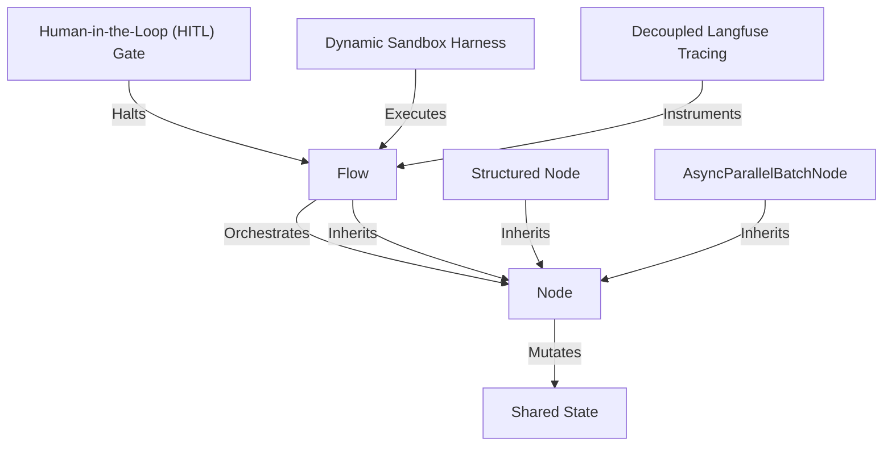

# Tutorial: pi-dynamic-workflow

Project **pi-dynamic-workflow** introduces *PocketFlow*, a lightweight, modular agentic orchestration framework built on three primary abstractions: a central **Shared State** dict acting as a single source of truth, worker **Nodes** split into decoupled prep/exec/post phases, and graph-based **Flows** acting as flexible supervisors. The framework provides specialized constructs like **Structured Nodes** (for schema-compliant deterministic LLM outputs), **AsyncParallelBatchNodes** (for high-speed competitive processing), and **Human-in-the-Loop (HITL) Gates** (for interactive safety overrides). Workflows are safely compiled, executed, and previewed utilizing a TypeScript-based **Dynamic Sandbox Harness** and automatically monitored with **Decoupled Langfuse Tracing**.

**Source Repository:** https://github.com/mbenetti/pi-dynamic-workflow.git

<h2>Chapters</h2>

1. [Shared State](01_shared_state.md)
2. [Node](02_node.md)
3. [Flow](03_flow.md)
4. [Structured Node](04_structured_node.md)
5. [AsyncParallelBatchNode](05_asyncparallelbatchnode.md)
6. [Human-in-the-Loop (HITL) Gate](06_human_in_the_loop_hitl_gate.md)
7. [Dynamic Sandbox Harness](07_dynamic_sandbox_harness.md)
8. [Decoupled Langfuse Tracing](08_decoupled_langfuse_tracing.md)

---
Generated by [Pi Tutorial Builder Extension](https://github.com/mbenetti/pi-tutorial-builder).