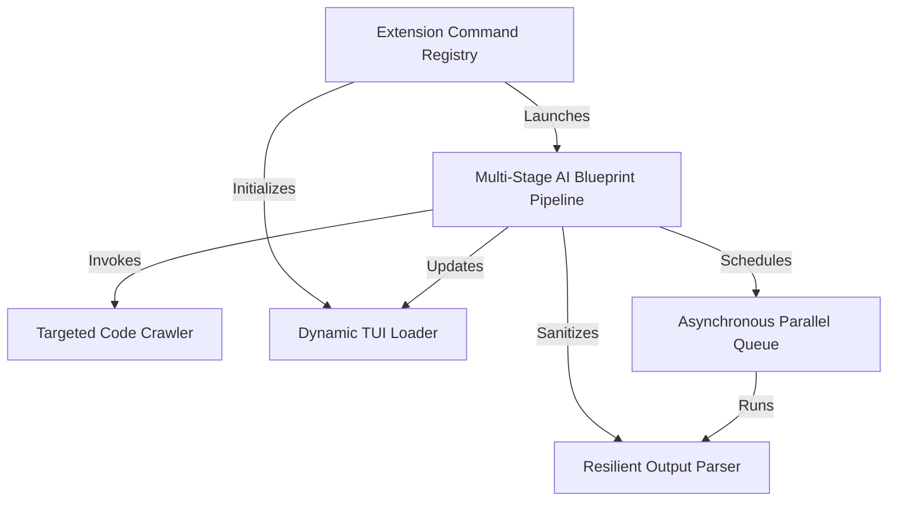

# Tutorial: pi-tutorial-builder

The **pi-tutorial-builder** is an automated repository-to-textbook compiler built as a Pi Coding Agent extension. It enables developers to transform dynamic directory trees or remote Git repositories into highly educational Markdown books. It leverages the **Extension Command Registry** to coordinate user parameter inputs, coordinates user feedback through the **Dynamic TUI Loader**, uses the **Targeted Code Crawler** to trim noise and feed high-fidelity codebase files into LLM developer contexts, and routes chapters into a **Multi-Stage AI Blueprint Pipeline**. The generator coordinates high-throughput AI writing calls utilizing an **Asynchronous Parallel Queue** and sanitizes raw model payloads via a robust **Resilient Output Parser** to format accurate, production-ready chapters natively in any language.

**Source Repository:** https://github.com/mbenetti/pi-tutorial-builder.git

<h2>Chapters</h2>

1. [Extension Command Registry](01_extension_command_registry.md)
2. [Dynamic TUI Loader](02_dynamic_tui_loader.md)
3. [Targeted Code Crawler](03_targeted_code_crawler.md)
4. [Multi-Stage AI Blueprint Pipeline](04_multi_stage_ai_blueprint_pipeline.md)
5. [Asynchronous Parallel Queue](05_asynchronous_parallel_queue.md)
6. [Resilient Output Parser](06_resilient_output_parser.md)

---
Generated by [Pi Tutorial Builder Extension](https://github.com/mbenetti/pi-tutorial-builder).