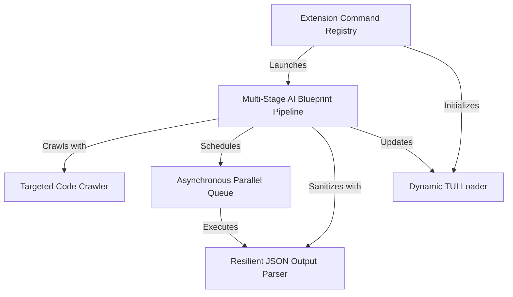

# Tutorial: pi-tutorial-builder

The **pi-tutorial-builder** is a zero-dependency CLI extension designed to transform a raw codebase into structured, highly informative markdown textbooks. It leverages the **Pi Coding Agent TUI** framework to securely crawl workspace elements, analyze architecture nodes using *multi-stage LLM chains*, concurrently dispatch modular chapter generation tasks via an *asynchronous processing queue*, and render progress visually to keep users comprehensively informed in real-time.

**Source Repository:** https://github.com/mbenetti/pi-tutorial-builder.git

<h2>Chapters</h2>

1. [Extension Command Registry](01_extension_command_registry.md)
2. [Dynamic TUI Loader](02_dynamic_tui_loader.md)
3. [Targeted Code Crawler](03_targeted_code_crawler.md)
4. [Multi-Stage AI Blueprint Pipeline](04_multi_stage_ai_blueprint_pipeline.md)
5. [Asynchronous Parallel Queue](05_asynchronous_parallel_queue.md)
6. [Resilient JSON Output Parser](06_resilient_json_output_parser.md)

---
Generated by [Pi Tutorial Builder Extension](https://github.com/mbenetti/pi-tutorial-builder).